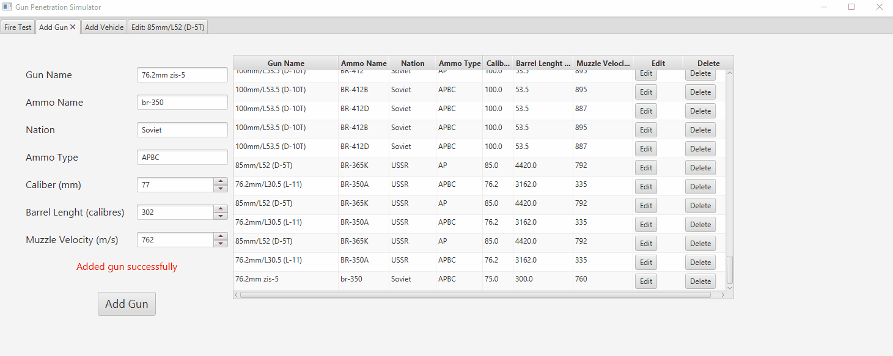
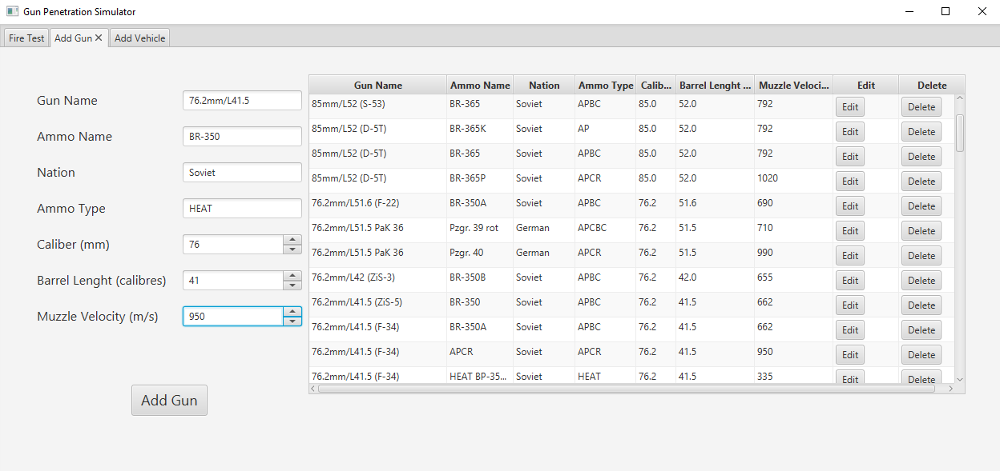
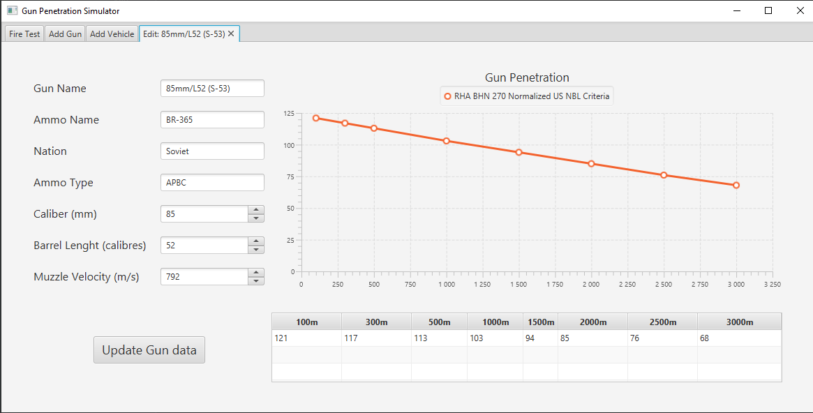
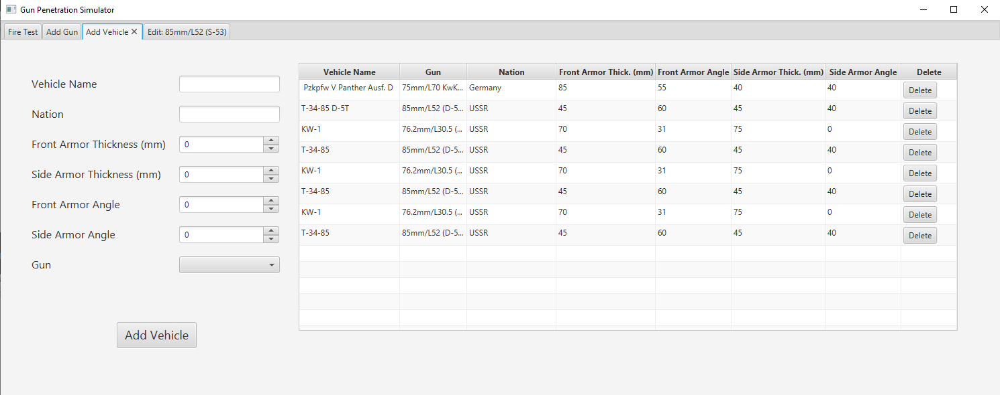
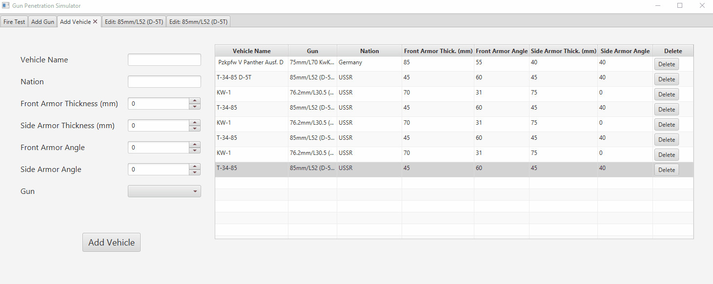
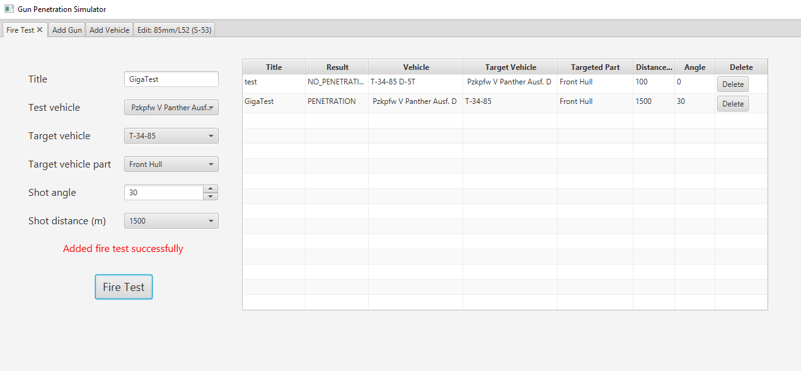
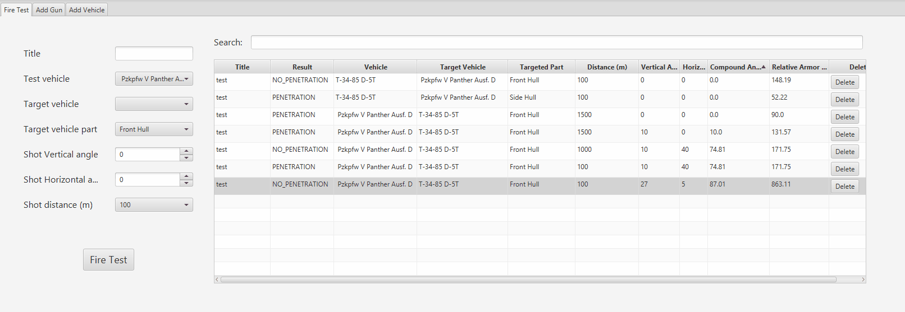
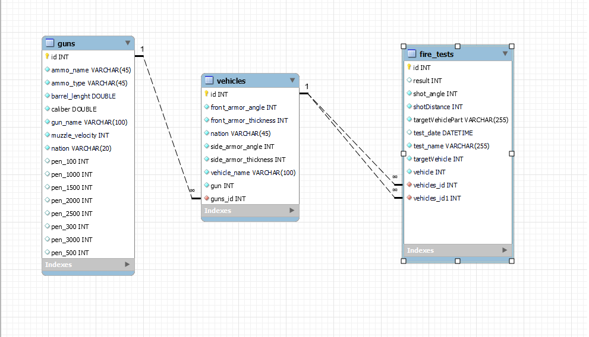

#  Gun Penetration Simulator : Java+JavaFX+Hibernate+SQLite CRUD Sample App

This App provides graphical interface to manipulate Tank Guns and Tanks/Vehicles datasets. Allows to create, remove, modify and delete them and perform simplified fire tests between vehicles/tanks based on guns penetration/ballistic tables. Demo database contains some WWII German and Soviet normalized gun and shell test data based on US Naval Ballistic Limit Penetration criteria (RHA Steel BHN 270 at zero degree)

# Basic usage
 
### Gun CRUD Interface:

View consists of TableView of all available guns in database. Gun form allows creating new Guns by entering gun data text fields and spinners. In TableView we can delete single records using "Delete" button, or examine and edit penetration table parameters or edit existing gun details using "Edit" button.

 

### Gun Edit Penetration Table CRUD Interface:

After editing details, press "Update Gun Data" button to commit changes.

 
 ### Vehicle CRUD Interface:

 Application provides similar interface to create vehicle. To add new vehicle, fill a form, select gun from existing database and press "Add Vehicle".
 
 
 

 ### FireTest CRUD Interface:

To perform fire tests you need to provide test vehicle from which we want to shot, angles, distance and target vehicle with targeted tank part (Front or Side hull). App calculates penetration result based on target tank relative armor thickness and penetration tables of tested tank gun

 
 

# Fire test Example

Let's calculate penetration result of firing at front plate of Pzkpfw V Panther from 85mm 
D-5T gun from soviet T-34-85 using a BR-365 APBC shell. Let's take the scenario: 
<ul>
<li>Tested tank (T-34-85) is 9 meters above (on hill) and 500 meters away target. From that, calculated vertical impact angle is approx. -1°.
</li>
<li>Panther is angling 30 degrees to the T-34-85 turret/gun, which is a horizontal angle. (Angling means that the hull (body) of the target tank faces the gun to the left/right at some degree)
</li>

</ul>

App calculates effective armor from formula:

From performed fire test and data from TableView we can read that relative armor value was about 145 mm. Knowing that Pzkpfw V front plate is sloped at 55° in this certain scenartio angle of attack was 5.4° higher and increased effective armor even more than firing from zero angled LOS (Line of sight). T-34-85 couldnt penetrate that amount of steel.
In current version of program shell type normalization angle is not counted into simulation.

# ERD Diagram

# Demo dataset sources
[http://www.panzer-war.com/page59.html](http://www.panzer-war.com/page59.html)  
[http://www.panzer-war.com/page58.html](http://www.panzer-war.com/page58.html)
[https://panzerworld.com/](https://panzerworld.com/)  
[http://amizaur.prv.pl/www.wargamer.org/GvA/weapons/soviet.html](http://amizaur.prv.pl/www.wargamer.org/GvA/weapons/soviet.html)  
[http://amizaur.prv.pl/www.wargamer.org/GvA/weapons/germany.html](http://amizaur.prv.pl/www.wargamer.org/GvA/weapons/germany.html)

