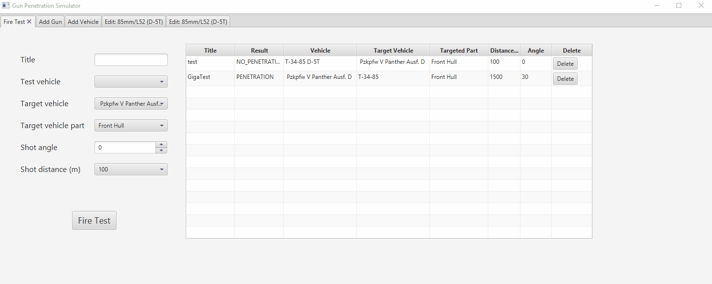

#  Gun Penetration Simulator : Java+JavaFX+Hibernate+SQLite CRUD Sample App

This App provides graphical interface to manipulate Tank Guns and Tanks/Vehicles datasets. Allows to create, remove, modify and delete them and perform simplified fire tests between vehicles/tanks based on guns penetration/balistic tables.

Demo database contains some WWII German and Soviet normalized gun&shell test data based on US Naval Ballistic Limit Penetration criteria (RHA Steel BHN 270)

# Basic usage
 Gun CRUD Interface:

 

Gun Edit Penetration Table CRUD Interface:

 
 Vehicle CRUD Interface:
 
 

 FireTest CRUD Interface:
 
 

# Demo dataset sources
[http://www.panzer-war.com/page59.html](http://www.panzer-war.com/page59.html)  
[http://www.panzer-war.com/page58.html](http://www.panzer-war.com/page58.html)
[https://panzerworld.com/](https://panzerworld.com/)  
[http://amizaur.prv.pl/www.wargamer.org/GvA/weapons/soviet.html](http://amizaur.prv.pl/www.wargamer.org/GvA/weapons/soviet.html)  
[http://amizaur.prv.pl/www.wargamer.org/GvA/weapons/germany.html](http://amizaur.prv.pl/www.wargamer.org/GvA/weapons/germany.html)
